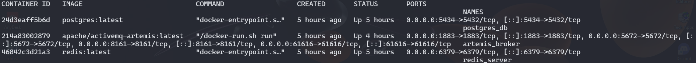
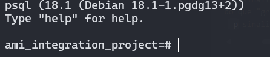
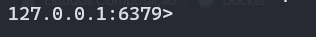
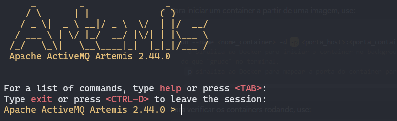
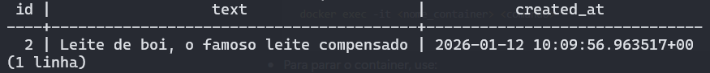
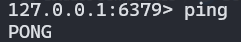
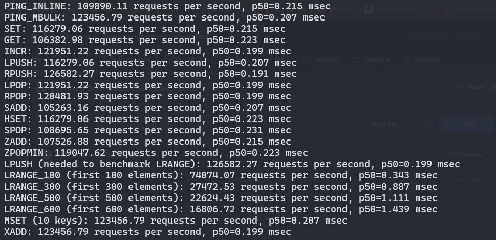
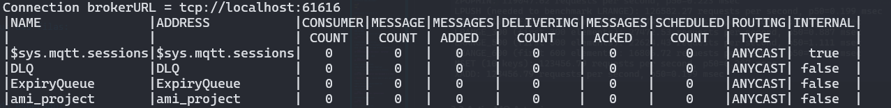

# Projeto 0 - Preparar o ambiente

## Índice

- [Visão Geral](#visão-geral)
- [Passo-a-Passo](#passo-a-passo)
  - [1. Criando arquivo docker-compose.yml e subindo Containers](#1-criando-arquivo-docker-composeyml-e-subindo-containers)
  - [2. Acessando cada um dos serviços via terminal](#2-acessando-cada-um-dos-serviços-via-terminal)
    - [2.1 PostgreSQL](#21-postgresql)
    - [2.2 Redis](#22-redis)
    - [2.3 ActiveMQ Artemis](#23-activemq-artemis)
  - [3. Executando comandos simples](#3-executando-comandos-simples)
    - [3.1 PostgreSQL](#31-postgresql)
    - [3.2 Redis](#32-redis)
    - [3.3 ActiveMQ Artemis](#33-activemq-artemis)

---

## Visão Geral

Antes de começar o projeto, será necessário aprender algumas coisas, adquirir alguns softwares…

Por padrão a equipe usa o **Intellij** para trabalhar com **java (17)**. De framework, trabalhamos com o **spring framework**.

O projeto principal tem uma estrutura bem similar ao padrão de projeto **Saga baseado em coreografia** com banco compartilhado (ou seja, um banco para a aplicação toda).

O **SGBD** usado majoritariamente é o **Postgres**, mas com ressalvas para usos pontuais no **OracleDb**.

Como o próprio padrão de projeto sugere, temos um meio para que possamos organizar a comunicação entre os módulos. No caso, usamos um gerenciador de filas **ActiveMQ Artemis**.

Para armazenar alguns valores comum da aplicação (expandindo o conceito de **variáveis de ambiente**) usamos um gerenciador de cache **Redis**. Assim, mesmo que o projeto esteja separado em mais de uma máquina, vão todos configurar as mesmas variáveis. Esse também é usado para armazenamento rápido de mensagens, ou como cache (de fato).

Para auxiliar na manutenção dos módulos, e na “inversão de dependência” entre eles, utiliza-se o **Eureka**. Assim, um módulo não precisa saber onde o outro está. Todos só precisam saber onde o Eureka está. Podendo assim realizar alguns **Load Balance**, fora a avaliação (superficial) do estado dos módulos do ambiente.

Tudo isso roda dentro de containeres no **Docker**, e são configurados com um **DockerCompose** e um **.env**.

Dito isso, a primeira atividade é configurar um ambiente minimalista para o projeto.

Instale o docker e crie um docker-compose que suba: Um redis, um activemq-artemis  e um postgresql.

Acesse cada um desses serviços via terminal, e execute comandos simples (criação, escrita, remoção)…

O entregável dessa atividade é um docker compose funcional e a demonstração de conhecimentos rudimentares nos sistemas acima.

---

## Passo-a-Passo

### 1. Criando arquivo docker-compose.yml e subindo Containers

O primeiro passo do projeto foi criar um arquivo [docker-compose.yml](/P0/docker-compose.yml) contendo os serviços requeridos e suas respectivas configurações.

Para subir todos os serviços, use o seguinte comando na pasta raiz [P0](/P0/):

````shell
docker compose up -d # A tag -d, d de detached, serve para liberar o terminal após iniciar os serviços.
````

Após subir os serviços, verifique os status deles com o seguinte comando:

````shell
docker ps -a # A tag -a serve para listar todos os containers, inclusive os parados ou encerrados.
````

Deve aparecer algo semelhante:



### 2. Acessando cada um dos serviços via terminal

#### 2.1 PostgreSQL

Para acessar o PostgreSQL, use o seguinte comando:

````shell
docker exec -it postgres_db psql -p 5432 -U ami -d ami_integration_project
# A tag -p serve para mapear a porta do container onde roda o PostgreSQL.
# A tag -U serve para indicar o usuário.
# A tag -d serve para indicar o banco de dados.
````

A saída do terminal será algo do tipo:



#### 2.2 Redis

Para acessar o Redis, use o seguinte comando:

````shell
docker exec -it redis_server redis-cli
````

A saída do terminal será algo do tipo:



#### 2.3 ActiveMQ Artemis

Para acessar o ActiveMQ Artemis, use o seguinte comando:

````shell
docker exec -it artemis_broker bin/artemis 
````

A saída do terminal será algo do tipo:



### 3. Executando comandos simples

#### 3.1 PostgreSQL

Vamos criar uma tabela simples chamada **todo**:

````sql
CREATE TABLE todo (
   id SERIAL,
   text TEXT,
   created_at TIMESTAMPTZ
) ;
````

Após isso, vamos inserir alguns valores:

````sql
INSERT INTO 
   todo
VALUES 
   ('Óia aí o cara', '2026-01-12 10:08:56.963517+00'),
   ('Leite de boi, o famoso leite compensado!', '2026-01-12 10:09:56.963517+00');
````

Verifique as tuplas adicionadas:

````sql
SELECT
   *
FROM
   todo;
````

Vamos eliminar a tupla de id = 1:

````sql
DELETE FROM
   todo
WHERE
   id = 1;
````

Ao final, é esperado algo do tipo:



#### 3.2 Redis

Vamos verificar se o serviço está funcionando:

````shell
ping
````

O retorno deve ser algo do tipo:



Agora, vamos criar um par chave-valor de String/Número:

````shell
SET apresentacao "Seja bem-vindo(a) à EletraTeam"
````

Leia o valor atrelado à chave:

````shell
GET apresentacao
````

Este é o resultado esperado:


Por último, valor realizar um teste de benchmark:

````shell
docker exec -it redis_server redis-benchmark -q -n 10000
````

> **Observação:** Antes, saia do redis-cli com o comando _**exit**_

Esta será a saída:



#### 3.3 ActiveMQ Artemis

Vamos criar uma fila:

````shell
queue create --user admin --password admin
````

Verifique o status das filas:

````shell
queue stat
````

Este é o resultado esperado:



Vamos simular um Producer:

````shell
producer --destination address://ami_project --message "Olá" --message-count 100
````
> **Observação:** Verifique o Status novamente e veja se as mensagens foram produzidas.

Vamos simular um Consumer:

````shell
consumer --destination queue://ami_project --message-count 100
````
> **Observação:** Verifique o Status novamente e veja se as mensagens foram consumidas.

Por último, vamos deletar a fila:

````shell
queue delete --name ami_project
````
> **Observação:** Verifique o Status novamente e veja se a fila foi deletada.