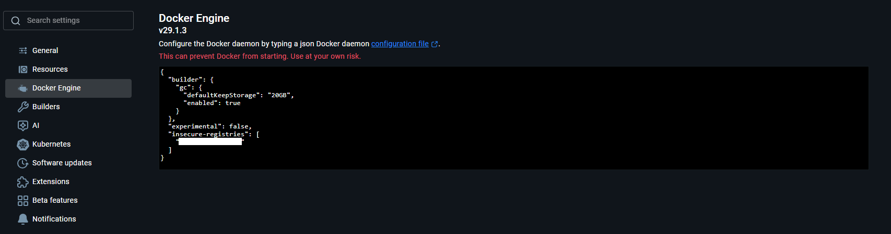
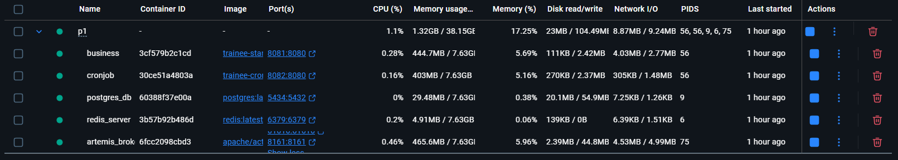
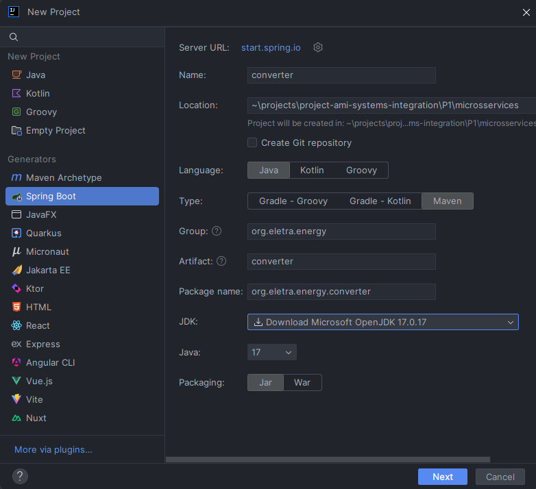
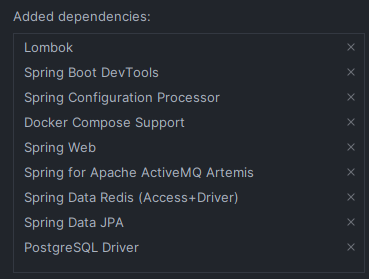
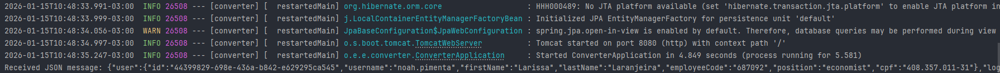
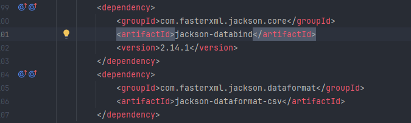
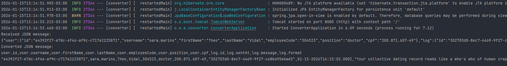
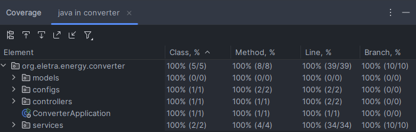

# Projeto 1 - Consumo Simples

## Índice

- [Lore](#lore)
- [Pré-condição](#pré-condição)
- [Atividade](#atividade)
- [Pós-condição](#pós-condição)
- [Relatório de variável de ambientes](#relatório-de-variável-de-ambientes)
- [Passo-a-Passo](#passo-a-passo)

## Lore

Primeiramente: bem-vinde! Você acabou de chegar na empresa, e suas atividades serão bem simples nesse primeiro momento. Que tal começar com algo fácil: converter uma mensagem JSON em um CSV.

As mensagens estão chegando via fila do ActiveMQ, mas estão formatadas em JSON. Para a aplicação, o cliente requer que seja feito o backup das mensagens em forma de CSV. Outro desenvolvedor está responsável pela funcionalidade de salvar essas mensagens em um arquivo. Você só precisa estruturar a mensagem do JSON para um CSV conforme abaixo:

```sql
# Formato de chegada 
{ 
    "username": "Tereza", 
    "createdAt": "2026-08-24 14:00:00", 
    "sentAt": "2026-08-24 13:59:00",
    "message": "yipe hey, yipe ho... e uma garrafa de rum!"
}

# Formato de saída
user,time,message
Tereza,2026-08-24 13:59:00,"yipe hey, yipe ho... e uma garrafa de rum!"
```

## Pré-condição

- Os serviços third-parties estão de pé e funcionando;
- Relação das variáveis de ambiente.

## Atividade

- Subir container rodando <ip_interno>/trainee-standard-business:latest
- Subir container rodando <ip_interno>/trainee-cronjob:latest
- Criar um projeto novo (um módulo) que use maven, springboot e java 17;
- Criar uma controller com um endpoint que leia da fila **training-converter.send_as_json**;
- Ler essa mensagem e converter o conteúdo dela para um CSV;
- Apresentar esse CSV no terminal.

## Pós-condição

- Uma CONVERTER foi criada;
- Está recebendo dados da BUSINESS fornecida;
- Os dados recebidos estão sendo formatados corretamente, e estão sendo apresentados no terminal, conforme chegam;
- A cobertura de teste é de 100%.

## Relatório de variável de ambientes

```
BROKER_URL:localhost
BROKER_PORT:61616
BROKER_USER:artemis
BROKER_PASSWORD:artemis

REDIS_HOST:localhost
REDIS_PORT:6379

DATASOURCE_JDBC:jdbc:postgresql://localhost:5432/trainee_integration_db
DATASOURCE_USERNAME:postgres
DATASOURCE_PASSWORD:n00b13
```

## Passo-a-Passo

### 1. Configurando Docker-Engine 

A primeira coisa que tive que fazer foi adicionar o ip do repositório interno de imagens da Eletra às configurações do Docker-Engine



> **Observação:** pergunte o ip do servidor a algum dos DEVs ou procure no Discord. 😁👍

### 2. Configurar docker-compose.yml e subir containers

Tive que adicionar os dois novos serviços ao [docker-compose.yml](docker-compose.yml), após isso, subi os containers usando o comando:

````shell
docker compose up -d
````

> **Observação:** tive que configurar as variáveis de ambiente, verifique no arquivo [docker-compose.yml](docker-compose.yml).

Após subir os serviços, é esperado algo do tipo:



### 3. Criando Projeto Java Spring

Usei a IntelliJ IDE da JetBrains para criar o módulo:



Adicionei essas dependências ao criar o Projeto, mesmo sabendo que não usarei algumas nesta etapa do desenvolvimento:



> **Observação:** Consulte a documentação do Spring: [HELP.md](microsservices/converter/HELP.md)

### 4. Configurando application.properties

Depois da criação do projeto, eu configurei o arquivo [application.properties](microsservices/converter/src/main/resources/application.properties) com as informações relacionadas ao Banco de Dados PostgreSQL e ao ActiveMQ Artemis.

### 5. Criando modelo Json.java e Controller JmsController.java

Criei um modelo [Json.java](microsservices/converter/src/main/java/org/eletra/energy/converter/models/Json.java) e um controller [JmsController.java](microsservices/converter/src/main/java/org/eletra/energy/converter/controllers/JmsController.java) que se conecta à fila artemis para receber a mensagem JSON.

Ao rodar a aplicação, deve aparecer algo do tipo:



### 6. Criando classe utilitária para converter Json para Csv

Primeiro, tive que adicionar ao [pom.xml](/P1/microsservices/converter/pom.xml) do projeto as seguintes dependências:



Depois, criei uma classe utils [JsonToCsvUtils](microsservices/converter/src/main/java/org/eletra/energy/converter/utils/JsonToCsvUtils.java) para converter o JSON para CSV.

Ao rodar a aplicação, deve ser visto algo do tipo:



### 7. Testes Unitários

Para concluir, realizei os testes unitários das classes do projeto:



> **Observação:** Garantindo 100% de cobertura.