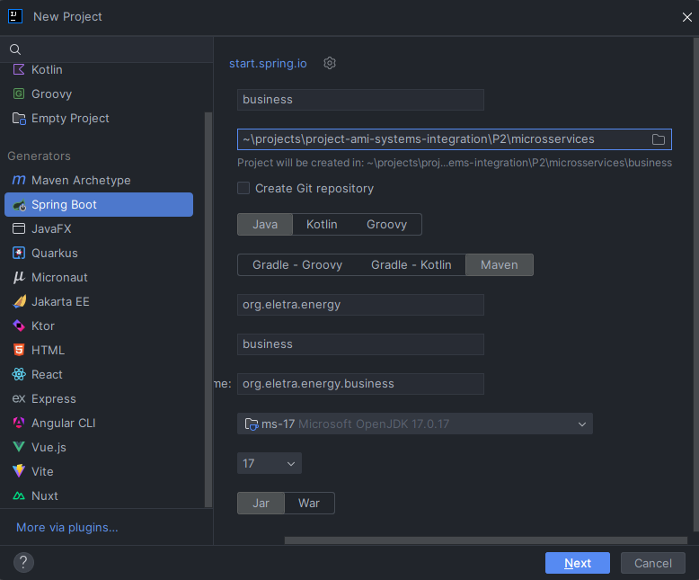
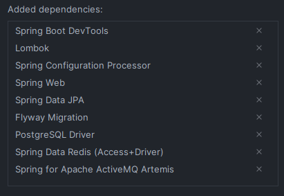
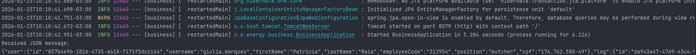
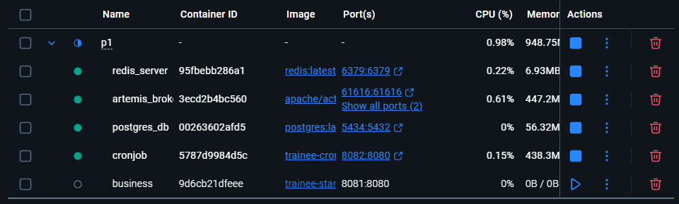
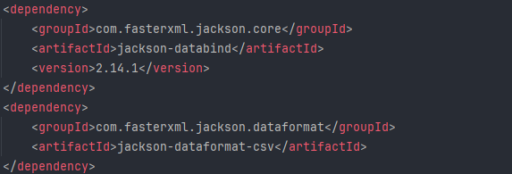
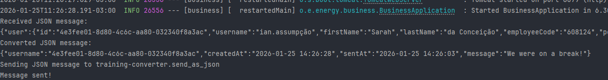
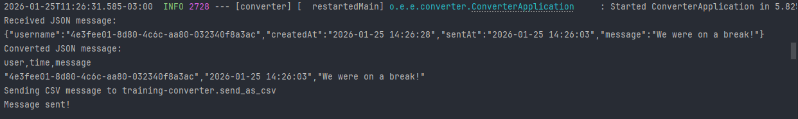
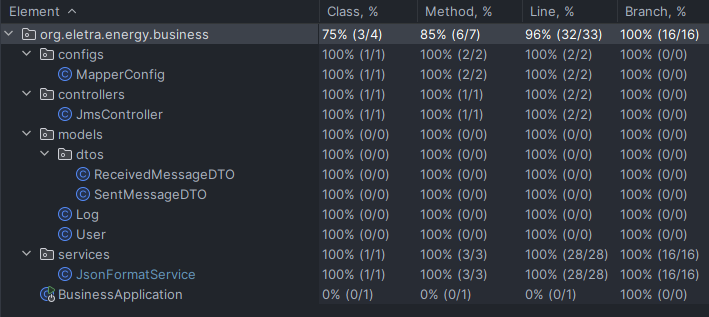

# Projeto 2 - Alteração nas regras de negócio

## Índice

- [Lore](#lore)
- [Pré-condição](#pré-condição)
- [Atividade](#atividade)
- [Pós-condição](#pós-condição)
- [Passo-a-Passo](#passo-a-passo)

## Lore

O cliente mudou a regra de negócio 🤬🤬🤬. O cliente não quer mais salvar o nome de usuário, mas sim o ID desse usuário. Porém, o BUSINESS antigo não pode ser alterado pois já está sendo usado por outro projeto. Sendo assim, você precisa criar um BUSINESS novo, que repasse esses dados para a CONVERTER previamente criada. ALTERAR A CONVERTER NÃO É UMA OPÇÃO!

## Pré-condição

- Os serviços third-parties estão de pé e funcionando;
- A converter criada na atividade passada.

## Atividade

- Criar um projeto novo (um módulo) que use maven, springboot e java 17;
- Criar uma controller com um endpoint que leia da fila **training-converter.receive_as_json;**
- Ler essa mensagem e converter o conteúdo dela para o JSON necessário na CONVERTER da atividade passada;
- Enviar a mensagem para a fila **training-converter.send_as_json;**

## Pós-condição

- Uma BUSINESS foi criada;
- Está recebendo dados da CONVERTER fornecida;
- Os dados recebidos estão sendo formatados corretamente, e estão sendo enviados para a CONVERTER desenvolvida na atividade passada;
- 100% de cobertura de teste.

## Passo-a-Passo

### 1. Criando Projeto Java Spring

Usei a IntelliJ IDE da JetBrains para criar o módulo:



Adicionei essas dependências ao criar o Projeto, mesmo sabendo que não usarei algumas nesta etapa do desenvolvimento:



> **Observação:** Consulte a documentação do Spring: [HELP.md](microsservices/business/HELP.md)

### 2. Configurando application.properties

Depois da criação do projeto, eu configurei o arquivo [application.properties](microsservices/business/src/main/resources/application.properties) com as informações relacionadas ao Banco de Dados PostgreSQL e ao ActiveMQ Artemis.

### 3. Criando modelo MessageModel.java e Controller JmsController.java

Criei um modelo [MessageModel.java](microsservices/business/src/main/java/org/eletra/energy/business/models/MessageModel.java) e um controller [JmsController.java](microsservices/business/src/main/java/org/eletra/energy/business/controllers/JmsController.java) que se conecta à fila artemis para receber a mensagem JSON. Utilizei a injeção de dependências via construtor na classe Controller, visto que ``@Autowired`` está deprecated!

Ao rodar a aplicação, deve aparecer algo do tipo:



### 4. Pausar o Container business

Como vamos criar uma nova business, a passada não é mais necessário no momento, logo, vamos pausá-la:



### 5. Criando classe Service para alterar o formato do Json

Primeiro, tive que adicionar ao [pom.xml](/P2/microsservices/business/pom.xml) do projeto as seguintes dependências:



Depois, criei uma classe Service [JsonFormatService](microsservices/business/src/main/java/org/eletra/energy/business/services/JsonFormatService.java) para alterar o formato do Json.

Ao rodar a aplicação [business](microsservices/business/), deve ser visto algo do tipo:



Rode a aplicação [converter](../P1/microsservices/converter/) e verifique se recebe o Json formatado corretamente:



### 6. Criar MapperConfig

Criei um [MapperConfig](/P2/microsservices/business/src/main/java/org/eletra/energy/business/configs/MapperConfig.java) para centralizar e expor como Beans algumas instâncias compartilhadas (Singletons).

### 7. Testes de Integração

Desta vez, preparei o ambiente para realizar testes de integração utilizando [Testcontainers](https://testcontainers.com/guides/getting-started-with-testcontainers-for-java/#_add_testcontainers_dependencies) em conjunto com testes unitários, mas antes adicionei ao [pom.xml](/P2/microsservices/business/pom.xml) do projeto as seguintes dependências do Testcontainer para o Artemis ActiveMQ, PostgreSQL e Redis:

`````java
<dependency>
    <groupId>org.testcontainers</groupId>
    <artifactId>junit-jupiter</artifactId>
    <version>1.19.4</version>
    <scope>test</scope>
</dependency>
<dependency>
    <groupId>org.testcontainers</groupId>
    <artifactId>testcontainers-activemq</artifactId>
    <version>2.0.1</version>
    <scope>test</scope>
</dependency>
<dependency>
    <groupId>org.testcontainers</groupId>
    <artifactId>testcontainers-postgresql</artifactId>
    <version>2.0.1</version>
    <scope>test</scope>
</dependency>
<dependency>
    <groupId>com.redis</groupId>
    <artifactId>testcontainers-redis</artifactId>
    <version>2.2.2</version>
    <scope>test</scope>
</dependency>
`````

E também removi as seguintes configurações do Artemis, PostgreSQL e Redis presentes no [application.properties](microsservices/business/src/test/resources/application.properties)

````
# Datasource Configuration
spring.datasource.url=jdbc:postgresql://localhost:5434/trainee_integration_db
spring.datasource.driver-class-name=org.postgresql.Driver
spring.datasource.username=admin
spring.datasource.password=admin

# JPA, SQL Configuration
spring.jpa.database-platform=org.hibernate.dialect.PostgreSQLDialect
spring.jpa.hibernate.ddl-auto=update
spring.jpa.show-sql=true
spring.jpa.properties.hibernate.format_sql=true

# Artemis Configuration
spring.artemis.broker-url=tcp://localhost:61616
spring.artemis.user=artemis
spring.artemis.password=artemis
````

Também adicionei:

````
# Disable JMS Listeners for Tests
spring.jms.listener.auto-startup=false
````

Depois, parti para o desenvolvimento dos testes, garantindo 100% de cobertura:



> **Observação:** Não há necessidade de realizar o teste direto do método main da Aplicação, visto que já há o teste de contexto!

### 8. Logging com Apache Log4j2

Vamos usar o [Log4j2](https://logging.apache.org/log4j/2.12.x/maven-artifacts.html) para realizar o logging do nosso microsserviço business.

Primeiro, é necessário adicionar a seguinte dependência ao [pom.xml](microsservices/business/pom.xml):

````
<!-- Exclude Logback -->
<dependency>
   <groupId>org.springframework.boot</groupId>
   <artifactId>spring-boot-starter</artifactId>
   <exclusions>
         <exclusion>
            <groupId>org.springframework.boot</groupId>
            <artifactId>spring-boot-starter-logging</artifactId>
         </exclusion>
   </exclusions>
</dependency>
<!-- Add Log4j2 -->
<dependency>
   <groupId>org.springframework.boot</groupId>
   <artifactId>spring-boot-starter-log4j2</artifactId>
</dependency>
````

> **Observação:** O Spring boot utiliza o Logback como logging padrão! Verifique a [documentação](https://docs.spring.io/spring-boot/how-to/logging.html)!

Depois, criei o arquivo de configuração [log4j2.xml](microsservices/business/src/main/resources/log4j2.xml) e fiz com que todos os status de logs fossem impressos no console e apenas os WARNs e ERRORs fossem escritos nos arquivos [application-[yyyy-MM-dd].log](microsservices/business/logs).

Entretanto, ao realizar os testes, percebi que os logs dos testes estavam indo para o mesmo arquivo, e isso não me parece correto! Logo, criei um novo arquivo de configuração [log4j2.xml](microsservices/business/src/test/resources/log4j2.xml) apenas para o escopo de testes. Agora, os logs dos testes são salvos no arquivo [application-tests.log](microsservices/business/logs/application-tests.log).