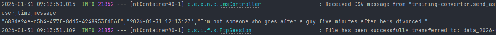
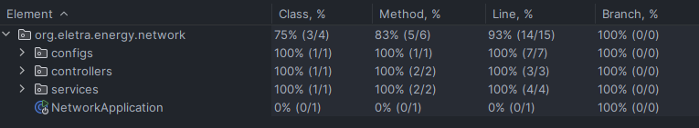
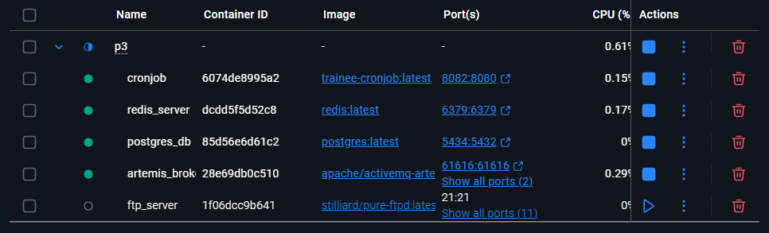
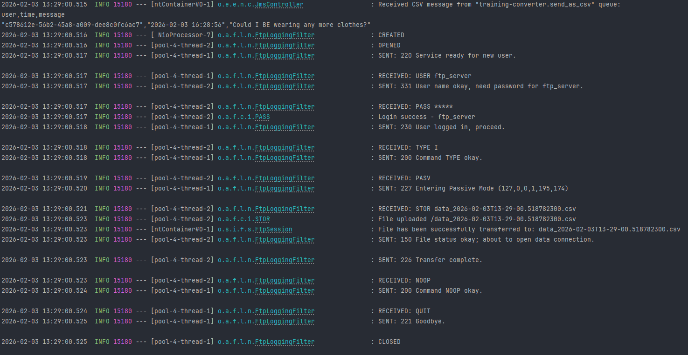
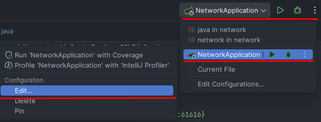
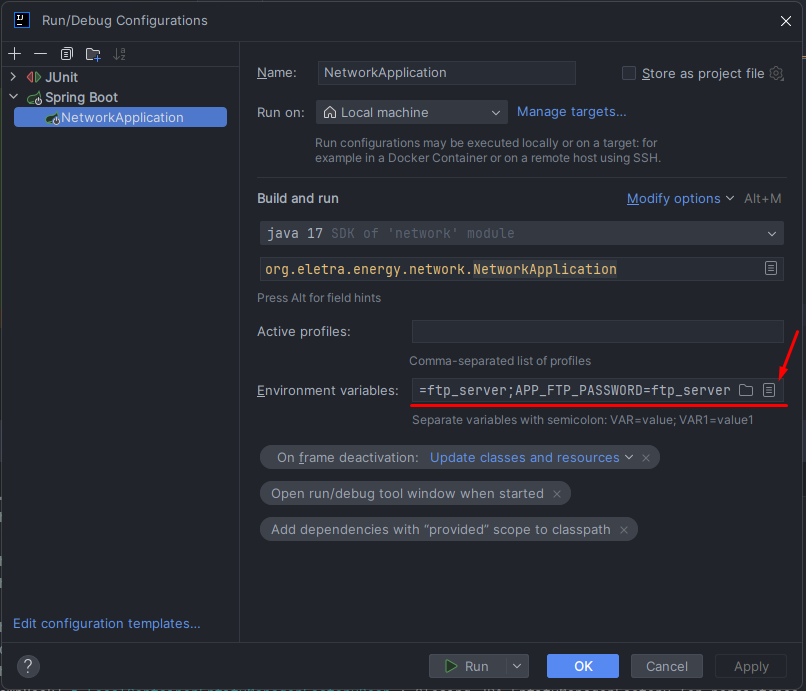
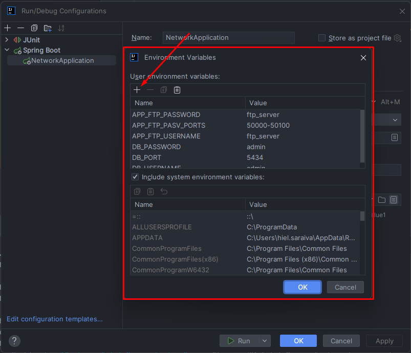

# Projeto 3 - O programador se demitiu…

## Índice

- [Lore](#lore)
- [Pré-condição](#pré-condição)
- [Atividade](#atividade)
- [Pós-condição](#pós-condição)
- [Passo-a-Passo](#passo-a-passo)

## Lore

Estivemos tentando contornar a situação, tratar de outra forma, mas… Não tivemos como. O outro desenvolvedor, que estava responsável por salvar os CSVs no servidor FTP, levou mais de 3 meses para terminar a atividade. Anunciou, na sexta-feira à tarde, que iria se desligar, ir para uma tal de RedSoft. Descobrimos também que não tinha muito desenvolvido… Não queríamos colocar uma tarefa com essa complexidade para você, sabemos que chegou agora. Mas o cliente está pedindo a funcionalidade com urgência.

## Pré-condição

- Os serviços third-parties foram servidor e estão funcionando;
- A CONVERTER criada nas atividades passadas;
- A BUSINESS criada na atividade passada.

## Atividade

- Criar um projeto novo (um módulo) que use maven, springboot e java 17;
- Criar uma controller com um endpoint que leia da fila **training-converter.send_as_csv;**
- Salvar esses dados em um arquivo .csv no servidor FTP fornecido;

## Pós-condição

- Uma NETWORK foi criada;
- Está recebendo dados da CONVERTER desenvolvida;
- Os dados recebidos estão sendo salvos em um arquivo CSV, dentro de um servidor FTP.

## Passo-a-Passo

### 1. Subindo container com server FTP

Primeiramente, vamos alterar o [docker-compose.yml](docker-compose.yml), vamos remover o container business, pois não está mais sendo usado, e adicionar um novo container para rodar o server FTP.

Após realizar a alteração, basta dar um ``docker compose up -d``

### 2. Criando Projeto Java Spring

Usei a IntelliJ IDE da JetBrains para criar o módulo:


Adicionei essas dependências ao criar o Projeto, mesmo sabendo que não usarei algumas nesta etapa do desenvolvimento:


> **Observação:** Consulte a documentação do Spring: [HELP.md](microsservices/network/HELP.md)

### 3. Configurando application.properties

Depois da criação do projeto, eu configurei o arquivo [application.properties](microsservices/network/src/main/resources/application.properties) com as informações relacionadas ao Banco de Dados PostgreSQL e ao ActiveMQ Artemis.

### 4. Logging com Apache Log4j2

Vamos usar o [Log4j2](https://logging.apache.org/log4j/2.12.x/maven-artifacts.html) para realizar o logging do nosso microsserviço network.

Primeiro, é necessário adicionar a seguinte dependência ao [pom.xml](microsservices/network/pom.xml):

````
<!-- Exclude Logback -->
<dependency>
   <groupId>org.springframework.boot</groupId>
   <artifactId>spring-boot-starter</artifactId>
   <exclusions>
         <exclusion>
            <groupId>org.springframework.boot</groupId>
            <artifactId>spring-boot-starter-logging</artifactId>
         </exclusion>
   </exclusions>
</dependency>
<!-- Add Log4j2 -->
<dependency>
   <groupId>org.springframework.boot</groupId>
   <artifactId>spring-boot-starter-log4j2</artifactId>
</dependency>
````

> **Observação:** O Spring boot utiliza o Logback como logging padrão! Verifique a [documentação](https://docs.spring.io/spring-boot/how-to/logging.html)!

Depois, criei o arquivo de configuração [log4j2.xml](microsservices/network/src/main/resources/log4j2.xml) e fiz com que todos os status de logs fossem impressos no console e apenas os WARNs e ERRORs fossem escritos nos arquivos [network-[yyyy-MM-dd].log](microsservices/network/logs).

Entretanto, ao realizar os testes, percebi que os logs dos testes estavam indo para o mesmo arquivo, e isso não me parece correto! Logo, criei um novo arquivo de configuração [log4j2.xml](microsservices/network/src/test/resources/log4j2.xml) apenas para o escopo de testes.

Para usar o logger do log4j2, basta usar a annotation ``@Log4j2`` na respectiva classe.

### 5. Criando Controler JmsController.java

Criei um controller [JmsController.java](microsservices/network/src/main/java/org/eletra/energy/network/controllers/JmsController.java) que se conecta à fila artemis para receber a mensagem CSV.

Ao rodar a aplicação, deve aparecer algo do tipo:


### 6. Criando classe Service para envio de arquivos CSV via FTP

Primeiramente, tive que adicionar essa dependência:

````
<dependency>
    <groupId>org.springframework.integration</groupId>
    <artifactId>spring-integration-ftp</artifactId>
    <version>7.0.2</version>
</dependency>
````

Depois, criei a classe de configuração [FtpConfig.java](microsservices/network/src/main/java/org/eletra/energy/network/configs/FtpConfig.java) para realizar a configuração inicial da nossa sessão FTP.

Na sequência, criei a classe [CsvFtpService.java](microsservices/network/src/main/java/org/eletra/energy/network/services/CsvFtpService.java) para realizar o envio do arquivo .csv para o server FTP.

Ao rodar, deve ser visto algo do tipo:



### 7. Testes de Integração

Desta vez, preparei o ambiente para realizar testes de integração utilizando [Testcontainers](https://testcontainers.com/guides/getting-started-with-testcontainers-for-java/#_add_testcontainers_dependencies) em conjunto com testes unitários, mas antes adicionei ao [pom.xml](/P3/microsservices/network/pom.xml) do projeto as seguintes dependências do Testcontainer para o Artemis ActiveMQ, PostgreSQL e Redis:

`````java
 <dependency>
   <groupId>org.testcontainers</groupId>
   <artifactId>testcontainers</artifactId>
   <scope>test</scope>
</dependency>
<dependency>
   <groupId>org.testcontainers</groupId>
   <artifactId>junit-jupiter</artifactId>
   <version>1.19.8</version>
   <scope>test</scope>
</dependency>
<dependency>
   <groupId>org.testcontainers</groupId>
   <artifactId>testcontainers-activemq</artifactId>
   <version>2.0.1</version>
   <scope>test</scope>
</dependency>
<dependency>
   <groupId>org.testcontainers</groupId>
   <artifactId>testcontainers-postgresql</artifactId>
   <version>2.0.1</version>
   <scope>test</scope>
</dependency>
<dependency>
   <groupId>com.redis</groupId>
   <artifactId>testcontainers-redis</artifactId>
   <version>2.2.2</version>
   <scope>test</scope>
</dependency>
`````

E também removi as seguintes configurações do Artemis, PostgreSQL e Redis presentes no [application.properties](microsservices/network/src/test/resources/application.properties)

````
# Datasource Configuration
spring.datasource.url=jdbc:postgresql://localhost:5434/trainee_integration_db
spring.datasource.driver-class-name=org.postgresql.Driver
spring.datasource.username=admin
spring.datasource.password=admin

# JPA, SQL Configuration
spring.jpa.database-platform=org.hibernate.dialect.PostgreSQLDialect
spring.jpa.hibernate.ddl-auto=update
spring.jpa.show-sql=true
spring.jpa.properties.hibernate.format_sql=true

# Artemis Configuration
spring.artemis.broker-url=tcp://localhost:61616
spring.artemis.user=artemis
spring.artemis.password=artemis
````

Também adicionei:

````
# Disable JMS Listeners for Tests
spring.jms.listener.auto-startup=false
````

Depois, parti para o desenvolvimento dos testes, garantindo 100% de cobertura:



> **Observação:** Não há necessidade de realizar o teste direto do método main da Aplicação, visto que já há o teste de contexto!

### Extra:

#### Server FTP Próprio

Falando com o Quela, ele sugeriu que eu mesmo criasse um Server FTP para o meu serviço em vez de subir uma imagem em um container.

Logo, vamos realizar essa substituição utilizando o [Apache FtpServer](https://mina.apache.org/ftpserver-project/).

1) Vamos adicionar as seguintes dependências ao [pom.xml](microsservices/network/pom.xml):

   ````
   <dependency>
      <groupId>org.apache.mina</groupId>
      <artifactId>mina-core</artifactId>
      <version>2.2.4</version>
   </dependency>
   <dependency>
      <groupId>org.apache.ftpserver</groupId>
      <artifactId>ftplet-api</artifactId>
      <version>1.2.1</version>
      <scope>compile</scope>
   </dependency>
   <dependency>
      <groupId>org.apache.ftpserver</groupId>
      <artifactId>ftpserver-core</artifactId>
      <version>1.2.1</version>
      <scope>compile</scope>
   </dependency>
   ````

2) Vamos pausar o container ftp_server:

   

3) Vamos criar um ``@Bean`` responsável por inicializar o server FTP ao inicializar o microsservice ``network``

   ````java
   @Bean
   public FtpServer ftpServer() throws Exception {
      FtpServerFactory serverFactory = new FtpServerFactory();

      /* O Listener é responsável por ouvir no socket de rede e quando o cliente se conecta,
         ele cria a sessão do usuário, executa comandos e assim por diante.
      */
      ListenerFactory listenerFactory = new ListenerFactory();
      listenerFactory.setPort(21);

      DataConnectionConfigurationFactory dataConnFactory = new DataConnectionConfigurationFactory();
      dataConnFactory.setPassivePorts("50000-50100");
      listenerFactory.setDataConnectionConfiguration(dataConnFactory.createDataConnectionConfiguration());

      serverFactory.addListener("default", listenerFactory.createListener());

      BaseUser user = new BaseUser();
      user.setName("ftp_server");
      user.setPassword("ftp_server");

      Path home = Paths.get(System.getProperty("user.home"), "ftp");
      Files.createDirectories(home);
      user.setHomeDirectory(home.toAbsolutePath().toString());

      // Aqui nós configuramos a permissão de escrita do nosso cliente user.
      List<Authority> authorities = new ArrayList<>();
      authorities.add(new WritePermission());
      user.setAuthorities(authorities);

      serverFactory.getUserManager().save(user);

      FtpServer server = serverFactory.createServer();
      server.start();
      return server;
   }
   ````

   > **Observação:** Verifique o [tutorial](https://mina.apache.org/ftpserver-project/embedding_ftpserver.html)

4) Agora, basta rodar o serviço ``network`` e verificar o log:

   

#### Variáveis de Ambiente

Conversando com o Quela novamente, ele me mostrou uma forma mais profissional de lidar com as variáveis de ambiente da aplicação.

1) Dentro do [application.properties](microsservices/network/src/main/resources/application.properties) nós podemos settar as nossas propriedades de configuração: 

   ````
   # Application Variables
   application.ftp.pasv_ports=${APP_FTP_PASV_PORTS:50000-50100}
   application.ftp.port=${APP_FTP_PORT:21}
   application.ftp.host=${APP_FTP_HOST:localhost}
   application.ftp.username=${APP_FTP_USERNAME:ftp_user}
   application.ftp.password=${APP_FTP_PASSWORD:ftp_password}
   application.ftp.listener=${APP_FTP_LISTENER:default}
   application.ftp.root_directory=${APP_FTP_ROOT_DIRECTORY:ftp}
   ````
   > **Obs.:** a notação ``${<VAR_ENV_NAME>:<DEFAULT_VALUE>}`` serve para atrelar o valor da propriedade de configuração a uma variável de ambiente e também para settar um valor default para ela.

2) Agora, onde configuro os valores das variáveis de ambiente? Existem algumas formas, mas a que eu achei mais adequada é utilizando as Configurações de Run/Debug do serviço, na IntelliJ IDEA:

   1) Clique em Editar Configurações
      
      

   2) Depois, clique em Editar variáveis de ambiente

      

   3) Por último, clique em Adicionar variável de ambiente

      
   
3) Depois, basta usar o annotation ``@Value`` para fazer referência a essses valores configurados no [application.properties](microsservices/network/src/main/resources/application.properties)

   ````java
      @Value("${application.ftp.pasv_ports}")
      private String ftpPasvPorts;

      @Value("${application.ftp.username}")
      private String ftpClientUsername;

      @Value("${application.ftp.password}")
      private String ftpClientPassword;

      @Value("${application.ftp.host}")
      private String ftpHost;

      @Value("${application.ftp.port}")
      private Integer ftpPort;

      @Value("${application.ftp.listener}")
      private String ftpListener;

      @Value("${application.ftp.root_directory}")
      private String ftpRootDirectory;
   ````