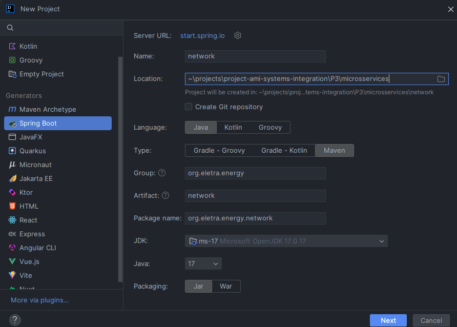
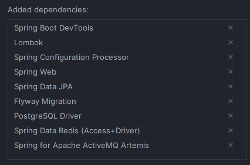
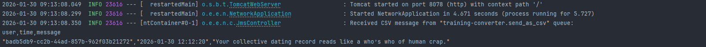

# Projeto 3 - O programador se demitiu…

## Índice

- [Lore](#lore)
- [Pré-condição](#pré-condição)
- [Atividade](#atividade)
- [Pós-condição](#pós-condição)
- [Passo-a-Passo](#passo-a-passo)

## Lore

Estivemos tentando contornar a situação, tratar de outra forma, mas… Não tivemos como. O outro desenvolvedor, que estava responsável por salvar os CSVs no servidor FTP, levou mais de 3 meses para terminar a atividade. Anunciou, na sexta-feira à tarde, que iria se desligar, ir para uma tal de RedSoft. Descobrimos também que não tinha muito desenvolvido… Não queríamos colocar uma tarefa com essa complexidade para você, sabemos que chegou agora. Mas o cliente está pedindo a funcionalidade com urgência.

## Pré-condição

- Os serviços third-parties foram servidor e estão funcionando;
- A CONVERTER criada nas atividades passadas;
- A BUSINESS criada na atividade passada.

## Atividade

- Criar um projeto novo (um módulo) que use maven, springboot e java 17;
- Criar uma controller com um endpoint que leia da fila **training-converter.send_as_csv;**
- Salvar esses dados em um arquivo .csv no servidor FTP fornecido;

## Pós-condição

- Uma NETWORK foi criada;
- Está recebendo dados da CONVERTER desenvolvida;
- Os dados percebido estão sendo salvos em um arquivo CSV, dentro de um servidor FTP.

## Passo-a-Passo

### 1. Subindo container com server FTP

Primeiramente, vamos alterar o [docker-compose.yml](docker-compose.yml), vamos remover o container business, pois não está mais sendo usado, e adicionar um novo container para rodar o server FTP.

Após realizar a alteração, basta dar um ``docker compose up -d``

### 2. Criando Projeto Java Spring

Usei a IntelliJ IDE da JetBrains para criar o módulo:



Adicionei essas dependências ao criar o Projeto, mesmo sabendo que não usarei algumas nesta etapa do desenvolvimento:



> **Observação:** Consulte a documentação do Spring: [HELP.md](microsservices/network/HELP.md)

### 3. Configurando application.properties

Depois da criação do projeto, eu configurei o arquivo [application.properties](microsservices/network/src/main/resources/application.properties) com as informações relacionadas ao Banco de Dados PostgreSQL e ao ActiveMQ Artemis.

### 4. Logging com Apache Log4j2

Vamos usar o [Log4j2](https://logging.apache.org/log4j/2.12.x/maven-artifacts.html) para realizar o logging do nosso microsserviço network.

Primeiro, é necessário adicionar a seguinte dependência ao [pom.xml](microsservices/network/pom.xml):

````
<!-- Exclude Logback -->
<dependency>
   <groupId>org.springframework.boot</groupId>
   <artifactId>spring-boot-starter</artifactId>
   <exclusions>
         <exclusion>
            <groupId>org.springframework.boot</groupId>
            <artifactId>spring-boot-starter-logging</artifactId>
         </exclusion>
   </exclusions>
</dependency>
<!-- Add Log4j2 -->
<dependency>
   <groupId>org.springframework.boot</groupId>
   <artifactId>spring-boot-starter-log4j2</artifactId>
</dependency>
````

> **Observação:** O Spring boot utiliza o Logback como logging padrão! Verifique a [documentação](https://docs.spring.io/spring-boot/how-to/logging.html)!

Depois, criei o arquivo de configuração [log4j2.xml](microsservices/network/src/main/resources/log4j2.xml) e fiz com que todos os status de logs fossem impressos no console e apenas os WARNs e ERRORs fossem escritos nos arquivos [network-[yyyy-MM-dd].log](microsservices/network/logs).

Entretanto, ao realizar os testes, percebi que os logs dos testes estavam indo para o mesmo arquivo, e isso não me parece correto! Logo, criei um novo arquivo de configuração [log4j2.xml](microsservices/network/src/test/resources/log4j2.xml) apenas para o escopo de testes.

Para usar o logger do log4j2, basta usar a annotation ``@Log4j2`` na respectiva classe.

### 5. Criando Controler JmsController.java

Criei um controller [JmsController.java](microsservices/network/src/main/java/org/eletra/energy/network/controllers/JmsController.java) que se conecta à fila artemis para receber a mensagem CSV.

Ao rodar a aplicação, deve aparecer algo do tipo:



### 6. Criando classe Service para envio de arquivos CSV via FTP

Primeiramente, tive que adicionar essas dependências:

````
<dependency>
    <groupId>org.springframework.integration</groupId>
    <artifactId>spring-integration-ftp</artifactId>
    <version>7.0.2</version>
</dependency>
````