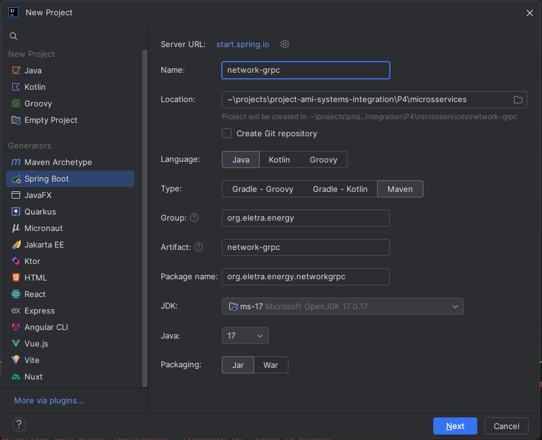
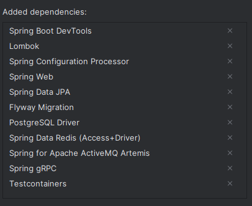
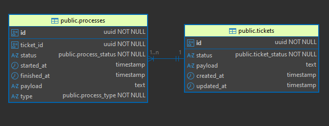
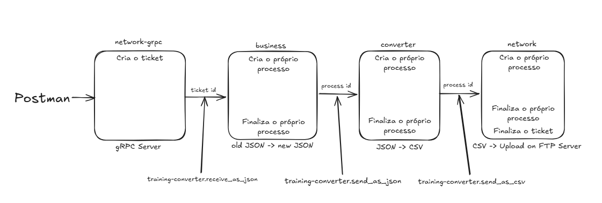

# Projeto 4 - O projeto evoluiu!

## Índice

- [Lore](#lore)
- [Pré-condição](#pré-condição)
- [Atividade](#atividade)
- [Pós-condição](#pós-condição)
- [Passo-a-Passo](#passo-a-passo)

## Lore

Felizmente está tudo dando certo, e agora temos um fluxo de ponta-a-ponta funcional!

Porém, nossos arquitetos viram que, a solução como está hoje, não é muito boa para que possamos identificar pontos de falhas, e manter históricos. Então, nesse momento, precisaremos adaptar a solução para usar um banco de dados!

## Pré-condição

- Os serviços third-parties estão funcionando;
- A CONVERTER criada nas atividades passadas;
- A BUSINESS criada nas atividades passadas;
- A NETWORK criada na atividade passada;
- .proto da API gRPC do cliente.

## Atividade
 
- Criar um projeto novo (um módulo) que use maven, springboot, java 17 e FLYWAY;
- Criar uma controller com um endpoint que leia da API gRPC;
- Criar migrations que descrevam o banco onde essas mensagens vão ser armazenadas;
- Persistir mensagens vindas do grpc no banco, na forma de tickets/processos (sendo um ticket um agrupamento de processos);
- Enviar o ID da mensagem para a fila training-converter.receive_raw;
- Alterar as CONVERTER/BUSINESS/NETWORK criadas nas atividades anteriores para receber o ID da mensagem via fila (não mais a mensagem);
- Adaptar o código para esse novo comportamento.

## Pós-condição

- Uma NETWORK-GRPC foi criada;
- As informações coletadas da API agora serão salvas no banco;
- Todo o fluxo agora trabalha somente com ID de mensagem, não mais com a mensagem pura;
- 100% de cobertura de teste.

## Passo-a-Passo

### 1. Entendendo o que é o gRPC API

- [O que é o gRPC](https://zup.com.br/blog/grpc-o-que-e-beagle/)
- [Diferença entre gRPC e REST](https://aws.amazon.com/pt/compare/the-difference-between-grpc-and-rest/)
- [Introdução ao gRPC](https://grpc.io/docs/what-is-grpc/introduction/)
- [Java with gRPC - Quickstart](https://grpc.io/docs/languages/java/quickstart/)

### 2. Subindo serviços Third-parties

Vamos subir os serviços utilizando o arquivo [docker-compose.yml](docker-compose.yml), basta usar o comando na pasta raiz P4:

````shell
docker compose up -d
````

### 3. Copiando microsserviços anteriores

Como vamos precisar alterar os microsserviços anteriormente construídos, vou criar cópias deles dentro da pasta [microsservices](microsservices/), pois não quero alterar o que foi já foi construído.

Dito isso, vou aproveitar o momento para realizar melhorias nos microsserviços ``converter`` e ``business``:

**Melhorias:**

- Converter:
   - Configurando variáveis de ambiente do projeto 
   - Implementando sistema de Log com Log4j2 
- Business:
   - Configurando variáveis de ambiente do projeto

Após as melhorias, rode os serviços e verifique se estão funcionando.

### 4. Criando Projeto Java Spring

Usei a IntelliJ IDE da JetBrains para criar o módulo:



Adicionei essas dependências ao criar o Projeto, incluindo a dependência do framework gRPC:



> **Observação:** Consulte a documentação do Spring: [HELP.md](microsservices/network-grpc/HELP.md)

### 5. Configurando application.properties

Depois da criação do projeto, eu configurei o arquivo [application.properties](microsservices/network-grpc/src/main/resources/application.properties) com as informações relacionadas ao Banco de Dados PostgreSQL, ao ActiveMQ Artemis e ao gRPC.

### 6. Logging com Apache Log4j2

Vamos usar o [Log4j2](https://logging.apache.org/log4j/2.12.x/maven-artifacts.html) para realizar o logging do nosso microsserviço network.

Primeiro, é necessário adicionar a seguinte dependência ao [pom.xml](microsservices/network-grpc/pom.xml):

````
<!-- Exclude Logback -->
<dependency>
   <groupId>org.springframework.boot</groupId>
   <artifactId>spring-boot-starter</artifactId>
   <exclusions>
         <exclusion>
            <groupId>org.springframework.boot</groupId>
            <artifactId>spring-boot-starter-logging</artifactId>
         </exclusion>
   </exclusions>
</dependency>
<!-- Add Log4j2 -->
<dependency>
   <groupId>org.springframework.boot</groupId>
   <artifactId>spring-boot-starter-log4j2</artifactId>
</dependency>
````

> **Observação:** O Spring boot utiliza o Logback como logging padrão! Verifique a [documentação](https://docs.spring.io/spring-boot/how-to/logging.html)!

Depois, criei o arquivo de configuração [log4j2.xml](microsservices/network-grpc/src/main/resources/log4j2.xml) e fiz com que todos os status de logs fossem impressos no console e apenas os WARNs e ERRORs fossem escritos nos arquivos [network-grpc-[yyyy-MM-dd].log](microsservices/network-grpc/logs).

Entretanto, ao realizar os testes, percebi que os logs dos testes estavam indo para o mesmo arquivo, e isso não me parece correto! Logo, criei um novo arquivo de configuração [log4j2.xml](microsservices/network-grpc/src/test/resources/log4j2.xml) apenas para o escopo de testes.

Para usar o logger do log4j2, basta usar a annotation ``@Log4j2`` na respectiva classe.

### 7. Modelagem do Banco

Durante a fase de modelagem do Banco de Dados, realizei a criação de duas tabelas: ``tickets`` e ``processes``, e dois enums: ``ticket_status`` e ``process_status``.

A relação entre as tabelas é 1:N, veja no diagrama:



### 8. Fluxo do Sistema

Eu projetei o fluxo do sistema da seguinte forma:



1. O server gRPC: ``network-grpc``, ao receber a requisição, vai criar um ticket com os campos: ``id``, ``status``, ``payload``, ``created_at`` e ``updated_at``, sendo o ``payload`` a mensagem enviada pelo cliente gRPC, o ``created_at`` o tempo de criação da tupla, atribuído automaticamente, e o ``status`` um enum que representa o estado do ticket, obviamente. Depois de criar a tupla com esses valores e armazenar no banco, o server gRPC vai enviar o id do ticket criado via fila para o próximo serviço: ``business``.

2. O serviço ``business``, ao receber o id do ticket, vai criar um processo com os campos: ``id``, ``ticket_id``, ``status``, ``started_at``, ``finished_at``, ``payload`` e ``type``, sendo ``ticket_id`` o id recebido via fila e ``type`` o serviço atual: ``BUSINESS``, ``CONVERTER`` ou ``NETWORK``. Depois disso, vai buscar no banco o payload do ticket corresponde a esse ``id`` e aplicará a lógica de negócio. Na sequência, irá salvar o ``payload`` do processo no banco e, após enviar o id do processo atual via fila para o próximo serviço: ``converter``, mudará o ``status`` do processo para ``SUCCESS``. 

3. O serviço ``converter``, ao receber o id do processo, vai criar um processo com os campos: ``id``, ``ticket_id``, ``status``, ``started_at``, ``finished_at``, ``payload`` e ``type``, sendo ``ticket_id`` o ticket_id do processo cujo id foi recebido via fila e ``type`` o serviço atual: ``BUSINESS``, ``CONVERTER`` ou ``NETWORK``. Depois disso, vai buscar no banco o payload do processo corresponde ao ``id`` recebido via fila e aplicará a lógica de negócio. Na sequência, irá salvar o ``payload`` do processo no banco e, após enviar o id do processo atual via fila para o próximo serviço: ``network``, mudará o ``status`` do processo para ``SUCCESS``. 

4. O serviço ``network``, ao receber o id do processo, vai criar um processo com os campos: ``id``, ``ticket_id``, ``status``, ``started_at``, ``finished_at``, ``payload`` e ``type``, sendo ``ticket_id`` o ticket_id do processo cujo id foi recebido via fila e ``type`` o serviço atual: ``BUSINESS``, ``CONVERTER`` ou ``NETWORK``. Depois disso, vai buscar no banco o payload do processo corresponde ao ``id`` recebido via fila e aplicará a lógica de negócio. Na sequência, irá salvar o ``payload`` do processo no banco e, após fazer o upload do arquivo .csv no Server FTP, mudará o ``status`` do processo para ``SUCCESS`` e o ``status`` do ticket para ``DONE``. 

> **Obs.:** Utilizei o envio do process_id via fila ao invés do ticket_id nos serviços: ``business`` e ``converter`` pois queria salvar o histórico dos payloads. Mandando sempre o ``ticket_id`` não possibilitaria isso...

### 9. Configurando network-grpc

0. Criei o arquivo .proto

1. Dei um mvn clean package para gerar as classes do protobuf de acordo com o .proto.

2. Coloquei a pasta do protobuf, onde são geradas as classes do protobuf, como Generated Source Root.

3. Corrigi as entidades, adicionei o columnDefinition = "TEXT" na coluna de payload, pois o Hibernate estava sobrescrevendo minha configuração da coluna.

4. Renomeei a classe GrpService e os métodos do .proto

5. 